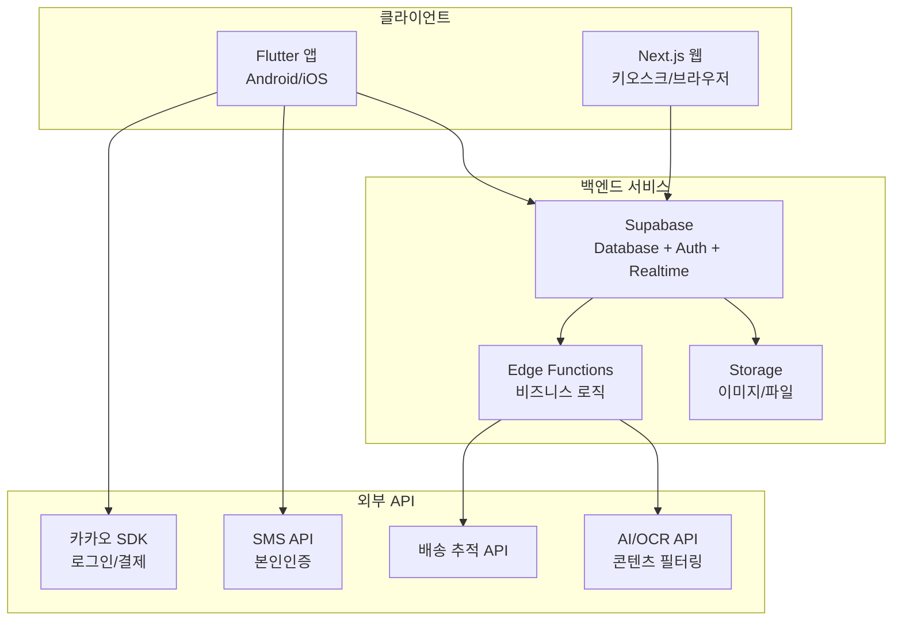
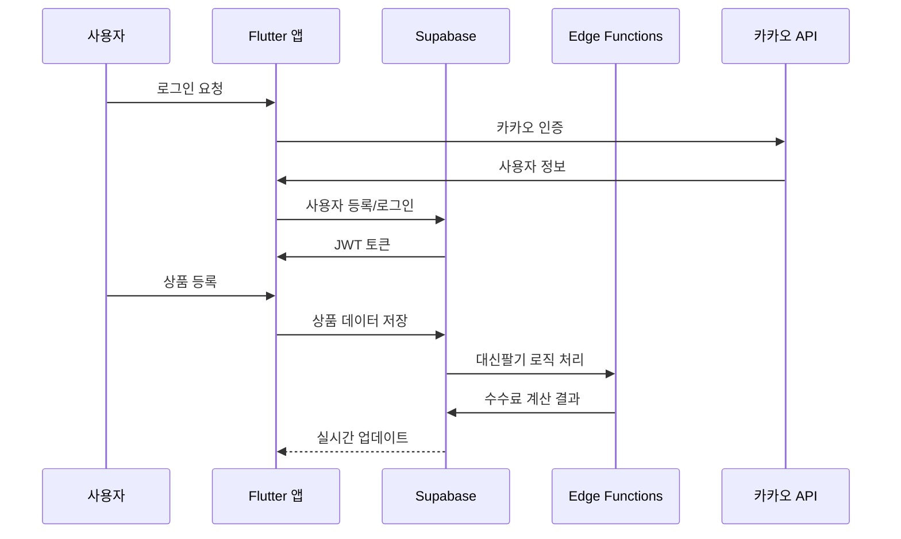
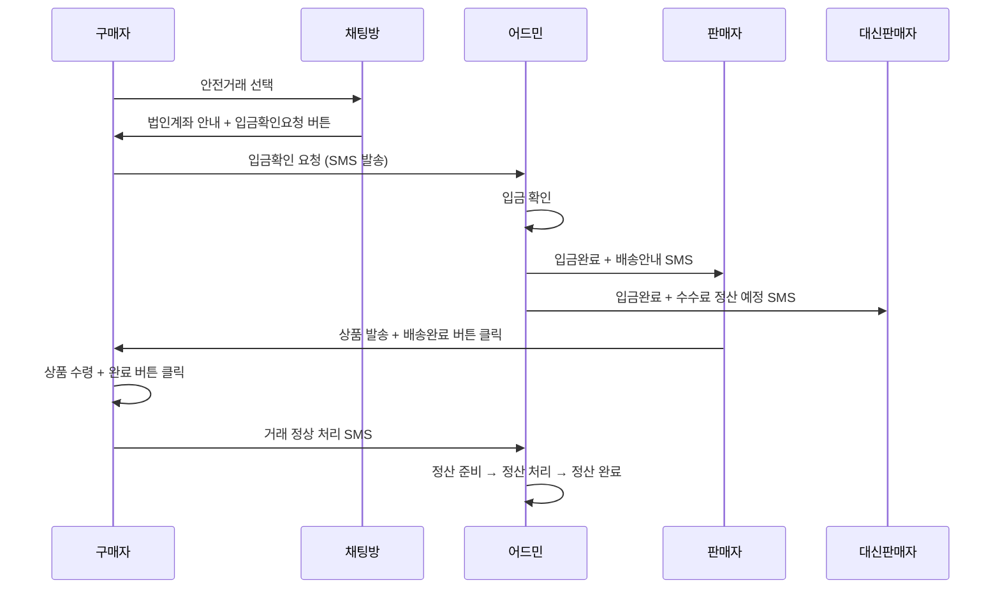

# 설계 문서

## 개요

대신팔기 기능을 핵심으로 하는 중개형 마켓플레이스의 기술 설계 문서입니다. Flutter 앱에서는 전체 기능을, Next.js 웹에서는 키오스크용 상품 조회 및 QR 연결 기능을 제공합니다. 안전거래 시스템과 실시간 채팅을 통해 신뢰할 수 있는 거래 환경을 구축합니다.

## 아키텍처

### 전체 시스템 아키텍처



### 데이터 플로우



## 컴포넌트 및 인터페이스

### 1. 인증 시스템

#### 카카오 로그인 컴포넌트
```typescript
interface KakaoAuthService {
  login(): Promise<KakaoUser>
  logout(): Promise<void>
  getUserInfo(): Promise<KakaoUserInfo>
}

interface KakaoUser {
  id: string
  name: string
  phoneNumber: string
  profileImage?: string
}
```

#### SMS 인증 컴포넌트
```typescript
interface SMSAuthService {
  sendVerificationCode(phoneNumber: string): Promise<void>
  verifyCode(phoneNumber: string, code: string): Promise<boolean>
}

interface User {
  id: string
  email: string // 사용자 ID
  name: string
  phone: string
  isVerified: boolean
  profileImage?: string
  role: 'general' | 'reseller' | 'admin'
  shopId?: string
}
```

### 2. 상품 관리 시스템

#### 상품 서비스
```typescript
interface ProductService {
  createProduct(product: CreateProductRequest): Promise<Product>
  updateProduct(id: string, updates: UpdateProductRequest): Promise<Product>
  deleteProduct(id: string): Promise<void>
  getProducts(filters: ProductFilters): Promise<Product[]>
  getProductById(id: string): Promise<Product>
  markAsSold(id: string): Promise<void>
}

interface Product {
  id: string
  title: string
  price: number
  description: string
  images: string[]
  category: string // 의류, 전자기기, 생활용품 등
  sellerId: string
  resaleEnabled: boolean
  resaleFee: number // 수수료 금액 (퍼센티지로 입력하되 자동 계산)
  status: '판매중' | '판매완료'
  createdAt: Date
  updatedAt: Date
}

interface Shop {
  id: string
  ownerId: string
  name: string
  description: string
  shareUrl: string
  products: Product[] // 등록된 상품
  resaleProducts: Product[] // 대신팔기 상품
}
```

### 3. 대신팔기 시스템

#### 대신판매 서비스
```typescript
interface ResaleService {
  addToMyShop(userId: string, productId: string): Promise<void>
  removeFromMyShop(userId: string, productId: string): Promise<void>
  getMyShop(userId: string): Promise<Shop>
  generateShopLink(userId: string): Promise<string>
  calculateCommission(productId: string, salePrice: number): Promise<CommissionBreakdown>
}

interface CommissionBreakdown {
  totalAmount: number
  originalSellerAmount: number
  resellerCommission: number
  commissionPercentage: number
}

// 대신팔기는 Shop의 resaleProducts 배열로 관리
// 별도 테이블 없이 Product와 Shop의 관계로 처리
```

### 4. 채팅 시스템

#### 실시간 채팅 서비스
```typescript
interface ChatService {
  createChat(participants: string[], transactionId: string): Promise<Chat>
  sendMessage(chatId: string, senderId: string, content: string): Promise<Message>
  getChatHistory(chatId: string): Promise<Message[]>
  subscribeToChat(chatId: string, callback: (message: Message) => void): () => void
}

interface Chat {
  id: string
  participants: string[] // 참여자 리스트
  transactionId: string
  messages: Message[]
  createdAt: Date
  updatedAt: Date
}

interface Message {
  id: string
  chatId: string
  senderId: string
  content: string
  createdAt: Date
}

interface Transaction {
  id: string
  productId: string
  price: number
  resaleFee: number
  buyerId: string
  sellerId: string
  resellerId?: string // 대신판매자 (있을 경우)
  status: '거래중' | '거래중단' | '거래완료'
  chatId: string
  createdAt: Date
  completedAt?: Date
}
```

### 5. 안전거래 시스템

#### 안전거래 서비스
```typescript
interface SafeTransactionService {
  createSafeTransaction(transactionId: string, depositAmount: number): Promise<SafeTransaction>
  confirmDeposit(safeTransactionId: string): Promise<void>
  confirmShipping(safeTransactionId: string): Promise<void>
  processSettlement(safeTransactionId: string): Promise<void>
  sendSMSNotification(phoneNumber: string, message: string): Promise<void>
}

interface SafeTransaction {
  id: string
  transactionId: string
  depositAmount: number
  depositConfirmed: boolean
  shippingConfirmed: boolean
  settlementStatus: '대기중' | '정산준비' | '정산완료'
  adminNotes?: string
  createdAt: Date
  updatedAt: Date
}

interface Review {
  id: string
  reviewerId: string
  transactionId: string
  comment: string
  createdAt: Date
}
```

## 데이터 모델

### 1. User (사용자) 테이블
```sql
CREATE TABLE users (
  id UUID PRIMARY KEY DEFAULT gen_random_uuid(),
  email VARCHAR(255) UNIQUE NOT NULL, -- 사용자 ID (카카오/전화번호 로그인 시 변경 활용)
  name TEXT NOT NULL, -- 사용자 이름
  phone TEXT UNIQUE NOT NULL, -- 전화번호 (고유)
  is_verified BOOLEAN DEFAULT false, -- 인증 여부
  profile_image TEXT, -- 프로필 사진 URL
  role VARCHAR(20) DEFAULT '일반', -- [일반, 대신판매자, 관리자]
  shop_id UUID REFERENCES shops(id), -- 나의 샵 연결
  created_at TIMESTAMP DEFAULT NOW(),
  updated_at TIMESTAMP DEFAULT NOW()
);
```

### 2. Shop (개인샵) 테이블
```sql
CREATE TABLE shops (
  id UUID PRIMARY KEY DEFAULT gen_random_uuid(),
  owner_id UUID REFERENCES users(id) NOT NULL,
  name TEXT NOT NULL, -- 샵 이름
  description TEXT, -- 설명
  share_url TEXT UNIQUE, -- 공유 가능한 URL
  created_at TIMESTAMP DEFAULT NOW(),
  updated_at TIMESTAMP DEFAULT NOW()
);
```

### 3. Product (상품) 테이블
```sql
CREATE TABLE products (
  id UUID PRIMARY KEY DEFAULT gen_random_uuid(),
  title TEXT NOT NULL,
  price INTEGER NOT NULL,
  description TEXT,
  images TEXT[] DEFAULT '{}', -- 이미지 URL 리스트
  category VARCHAR(50) NOT NULL, -- [의류, 전자기기, 생활용품 등]
  seller_id UUID REFERENCES users(id) NOT NULL, -- 원 판매자
  resale_enabled BOOLEAN DEFAULT false, -- 대신팔기 가능 여부
  resale_fee INTEGER DEFAULT 0, -- 수수료 금액 (퍼센티지로 입력하되 자동 계산하여 금액으로 저장)
  status VARCHAR(20) DEFAULT '판매중', -- [판매중, 판매완료]
  created_at TIMESTAMP DEFAULT NOW(),
  updated_at TIMESTAMP DEFAULT NOW()
);
```

### 4. Transaction (거래 정보) 테이블
```sql
CREATE TABLE transactions (
  id UUID PRIMARY KEY DEFAULT gen_random_uuid(),
  product_id UUID REFERENCES products(id) NOT NULL,
  price INTEGER NOT NULL, -- 상품 금액
  resale_fee INTEGER DEFAULT 0, -- 수수료 금액
  buyer_id UUID REFERENCES users(id) NOT NULL,
  seller_id UUID REFERENCES users(id) NOT NULL,
  reseller_id UUID REFERENCES users(id), -- 대신판매자 (있을 경우)
  status VARCHAR(20) DEFAULT '거래중', -- [거래중, 거래중단, 거래완료]
  chat_id UUID REFERENCES chats(id),
  created_at TIMESTAMP DEFAULT NOW(),
  completed_at TIMESTAMP
);
```

### 5. Chat (채팅방) 테이블
```sql
CREATE TABLE chats (
  id UUID PRIMARY KEY DEFAULT gen_random_uuid(),
  participants UUID[] NOT NULL, -- 참여자 리스트
  transaction_id UUID REFERENCES transactions(id),
  created_at TIMESTAMP DEFAULT NOW(),
  updated_at TIMESTAMP DEFAULT NOW()
);
```

### 6. Message (채팅 메시지) 테이블
```sql
CREATE TABLE messages (
  id UUID PRIMARY KEY DEFAULT gen_random_uuid(),
  chat_id UUID REFERENCES chats(id) NOT NULL,
  sender_id UUID REFERENCES users(id) NOT NULL,
  content TEXT NOT NULL,
  created_at TIMESTAMP DEFAULT NOW()
);
```

### 7. Review (후기) 테이블
```sql
CREATE TABLE reviews (
  id UUID PRIMARY KEY DEFAULT gen_random_uuid(),
  reviewer_id UUID REFERENCES users(id) NOT NULL,
  transaction_id UUID REFERENCES transactions(id) NOT NULL,
  comment TEXT NOT NULL,
  created_at TIMESTAMP DEFAULT NOW()
);
```

### 8. Safe_Transaction (안전거래 관리) 테이블
```sql
CREATE TABLE safe_transactions (
  id UUID PRIMARY KEY DEFAULT gen_random_uuid(),
  transaction_id UUID REFERENCES transactions(id) NOT NULL,
  deposit_amount INTEGER NOT NULL, -- 입금 금액
  deposit_confirmed BOOLEAN DEFAULT false, -- 입금 확인 여부
  shipping_confirmed BOOLEAN DEFAULT false, -- 배송 확인 여부
  settlement_status VARCHAR(20) DEFAULT '대기중', -- [대기중, 정산준비, 정산완료]
  admin_notes TEXT, -- 관리자 메모
  created_at TIMESTAMP DEFAULT NOW(),
  updated_at TIMESTAMP DEFAULT NOW()
);
```

### 관계 설정
- User는 하나의 Shop을 가질 수 있음
- Shop은 여러 Product를 가질 수 있음 (직접 등록 + 대신팔기)
- Product는 여러 Transaction을 가질 수 있음
- Transaction은 하나의 Chat을 가짐
- Chat은 여러 Message를 가짐
- Transaction은 여러 Review를 가질 수 있음

## 핵심 비즈니스 로직

### 1. 안전거래 프로세스



### 2. 대신팔기 수수료 계산
- 사용자가 퍼센티지로 입력 (제한 없음)
- 시스템이 자동으로 금액 계산하여 저장
- 대신판매자는 마이페이지에서 수수료 정보 확인 가능

### 3. 거래 완료 정책
- 상품 등록자(판매자)가 거래완료 버튼을 눌러야 함
- 일반거래: 판매자가 직접 거래완료 처리
- 안전거래: 구매자 완료 버튼 → 어드민 정산 처리 → 최종 완료

### 4. 리뷰 시스템
- 거래 완료 후 모든 참여자가 서로 리뷰 가능 (강제 아님)
- 판매자 ↔ 구매자
- 대신판매자 ↔ 상품등록자 (대신판매 거래 시)

### 5. 웹앱 페이지 구조
#### 모바일 앱 (Flutter)
- 전체 기능 제공: 로그인, 상품등록, 채팅, 거래, 결제
- Index(홈): 상품 리스트, 카테고리 필터, 검색, 최신순 정렬
- Product Detail: 이미지 슬라이드, 구매하기/대신팔기 버튼
- My Page: 프로필, 내 샵, 상품 관리, 거래내역
- Chat: 1:1 채팅, 안전거래/일반거래 선택

#### 웹 (키오스크 전용)
- 상품 조회 전용: 로그인/거래 버튼 없음
- Home: 상품 카드 목록, 카테고리/검색 필터
- Product Detail: 구매하기/대신팔기 클릭 시 QR 팝업
- Admin: 유저 관리, 상품 관리, 거래 현황, 안전거래 관리

## 에러 처리

### 에러 분류 및 처리 전략

#### 1. 인증 에러
```typescript
enum AuthError {
  INVALID_CREDENTIALS = 'INVALID_CREDENTIALS',
  TOKEN_EXPIRED = 'TOKEN_EXPIRED',
  PHONE_VERIFICATION_FAILED = 'PHONE_VERIFICATION_FAILED',
  DUPLICATE_PHONE = 'DUPLICATE_PHONE'
}
```

#### 2. 비즈니스 로직 에러
```typescript
enum BusinessError {
  PRODUCT_NOT_FOUND = 'PRODUCT_NOT_FOUND',
  INSUFFICIENT_LEVEL = 'INSUFFICIENT_LEVEL',
  RESALE_LIMIT_EXCEEDED = 'RESALE_LIMIT_EXCEEDED',
  TRANSACTION_NOT_ALLOWED = 'TRANSACTION_NOT_ALLOWED',
  PAYMENT_FAILED = 'PAYMENT_FAILED'
}
```

#### 3. 시스템 에러
```typescript
enum SystemError {
  DATABASE_ERROR = 'DATABASE_ERROR',
  EXTERNAL_API_ERROR = 'EXTERNAL_API_ERROR',
  FILE_UPLOAD_ERROR = 'FILE_UPLOAD_ERROR',
  REALTIME_CONNECTION_ERROR = 'REALTIME_CONNECTION_ERROR'
}
```

### 에러 처리 미들웨어
```typescript
class ErrorHandler {
  static handle(error: AppError): ErrorResponse {
    switch (error.type) {
      case 'AUTH_ERROR':
        return this.handleAuthError(error)
      case 'BUSINESS_ERROR':
        return this.handleBusinessError(error)
      case 'SYSTEM_ERROR':
        return this.handleSystemError(error)
      default:
        return this.handleUnknownError(error)
    }
  }
}
```

## 테스팅 전략

### 1. 단위 테스트
- 각 서비스 클래스의 메서드별 테스트
- 데이터 모델 검증 테스트
- 유틸리티 함수 테스트

### 2. 통합 테스트
- API 엔드포인트 테스트
- 데이터베이스 연동 테스트
- 외부 API 연동 테스트

### 3. E2E 테스트
- 사용자 회원가입부터 거래 완료까지 전체 플로우
- 대신팔기 기능 전체 플로우
- 채팅 및 실시간 기능 테스트

### 4. 성능 테스트
- 동시 사용자 처리 능력
- 데이터베이스 쿼리 성능
- 실시간 메시징 성능

### 테스트 환경 구성
```typescript
// Jest 설정 예시
export const testConfig = {
  supabase: {
    url: process.env.SUPABASE_TEST_URL,
    key: process.env.SUPABASE_TEST_ANON_KEY
  },
  kakao: {
    testMode: true,
    mockResponses: true
  }
}
```

## 보안 고려사항

### 1. 데이터 보안
- 개인정보 암호화 저장 (AES-256)
- 전화번호 해싱 처리
- 결제 정보 토큰화

### 2. API 보안
- JWT 토큰 기반 인증
- Rate Limiting 적용
- CORS 정책 설정
- SQL Injection 방지

### 3. 거래 보안
- 안전거래 에스크로 시스템
- 이중 인증 (2FA) 지원
- 거래 내역 감사 로그

### 보안 미들웨어
```typescript
class SecurityMiddleware {
  static validateJWT(token: string): Promise<User> {
    // JWT 검증 로직
  }
  
  static encryptSensitiveData(data: string): string {
    // 민감 데이터 암호화
  }
  
  static auditLog(action: string, userId: string, metadata: any): void {
    // 감사 로그 기록
  }
}
```

## 성능 최적화

### 1. 데이터베이스 최적화
- 인덱스 전략: 검색 빈도가 높은 컬럼에 인덱스 생성
- 쿼리 최적화: N+1 문제 해결을 위한 JOIN 활용
- 캐싱 전략: Redis를 활용한 자주 조회되는 데이터 캐싱

### 2. 이미지 최적화
- WebP 포맷 사용
- 다양한 해상도별 이미지 생성
- CDN을 통한 이미지 배포

### 3. 실시간 기능 최적화
- WebSocket 연결 풀링
- 메시지 배치 처리
- 불필요한 실시간 업데이트 최소화

## 모니터링 및 로깅

### 1. 애플리케이션 모니터링
- 에러 추적 (Sentry)
- 성능 모니터링 (APM)
- 사용자 행동 분석

### 2. 비즈니스 메트릭
- 거래 성공률
- 대신팔기 활용률
- 사용자 레벨 분포
- 수수료 수익 현황

### 3. 시스템 메트릭
- API 응답 시간
- 데이터베이스 성능
- 실시간 연결 상태
- 서버 리소스 사용률